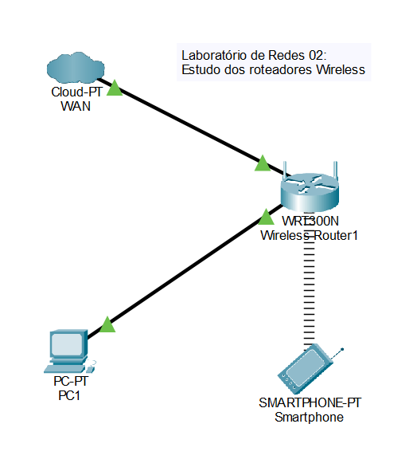

# Laboratório de Redes 2 - Roteadores Wireless

Alunos: Nicolas Lopes, Sara Oliveira

Professor: José de Assis

Data: 10/03/2026

---

## **1. Objetivo:**
Realizar uma configuração básica de rede Wifi utilizando 1 roteador e 1 desktop
<!--
O projeto será dividido em 2 etapas:

1. Simulação da Rede no Cisco Packet Tracer
2. Implementação da rede no laboratório real

  <strong>Imagem da topologia usada neste laboratório:</strong>  
  

-->
