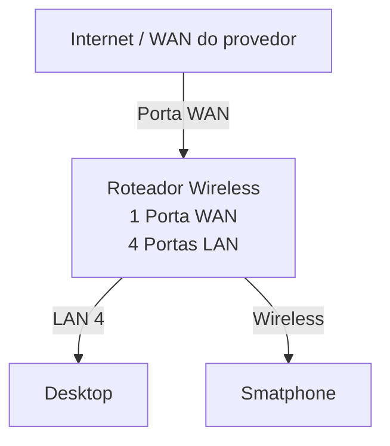

# Laboratório de Redes 2 - Roteadores Wireless

Alunos: Nicolas Lopes, Sara Oliveira

Professor: José de Assis

Data: 10/03/2026

---

## **1. Objetivo:**
- Realizar uma configuração básica de rede Wifi utilizando 1 roteador e 1 desktop
- Criar uma rede invisível e alterar a senha de acesso para o roteador

O projeto será dividido em 2 etapas:

1. Simulação da Rede no Cisco Packet Tracer
2. Implementação da rede no laboratório real

---

## **2. Equipamentos usados nesse laboratório:**

- 1 Desktop
- 1 Roteador Wireless com 1 porta WAN e 4 portas LAN
- Cabo de rede

---

## **3. Topologia da Rede:**

Diagrama lógico da rede usada neste laboratório. 

  <strong>Imagem da topologia usada neste laboratório:</strong>  
  

